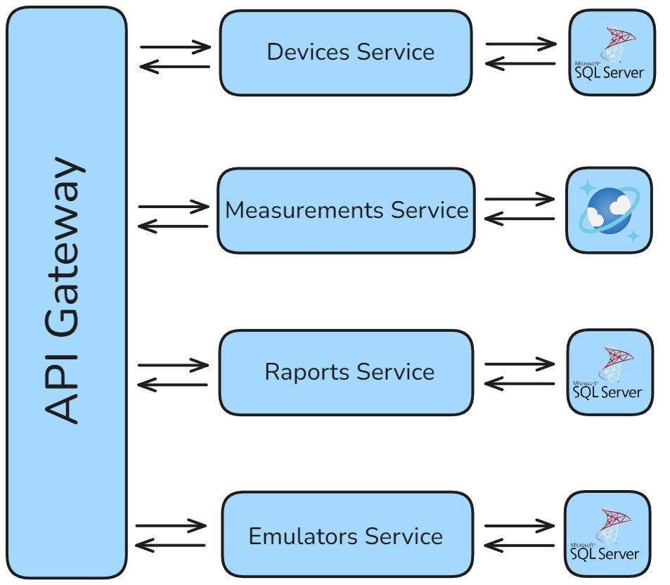
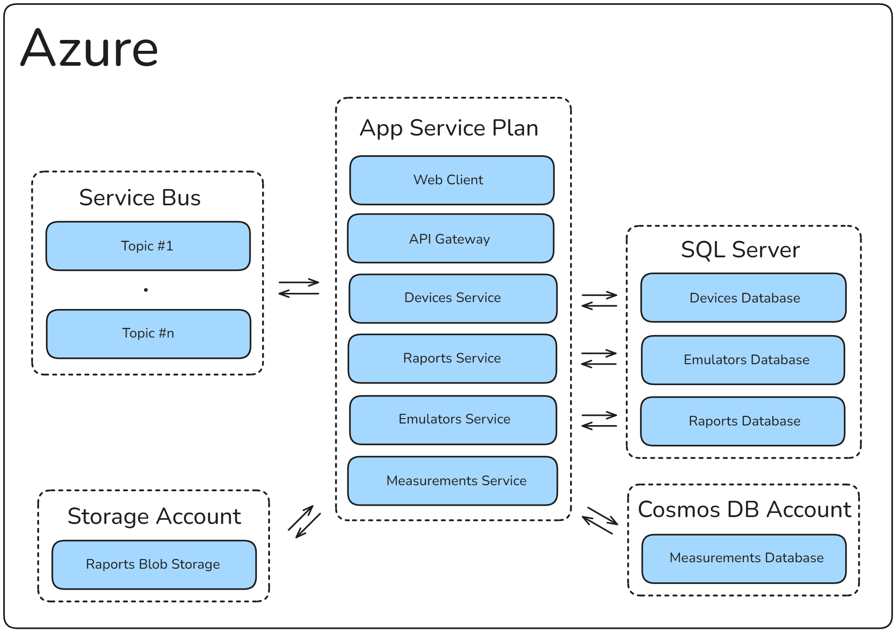
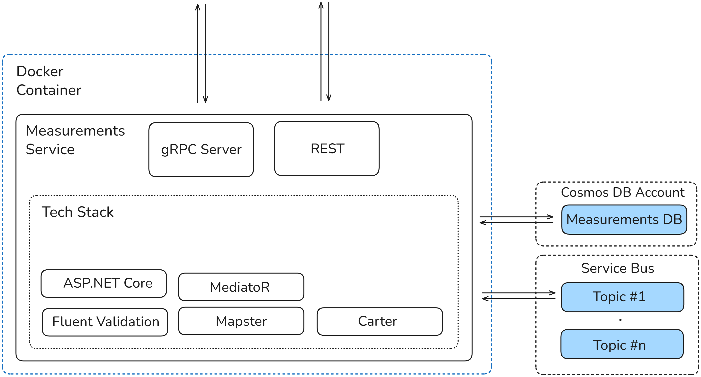
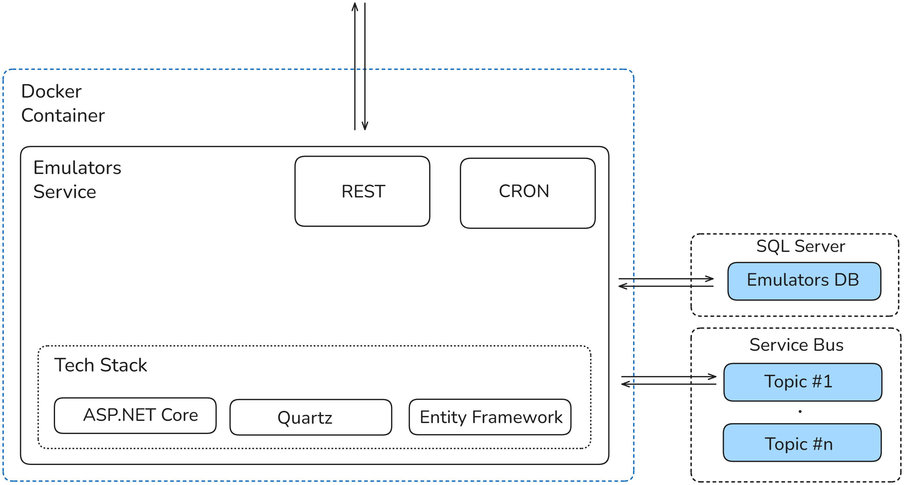
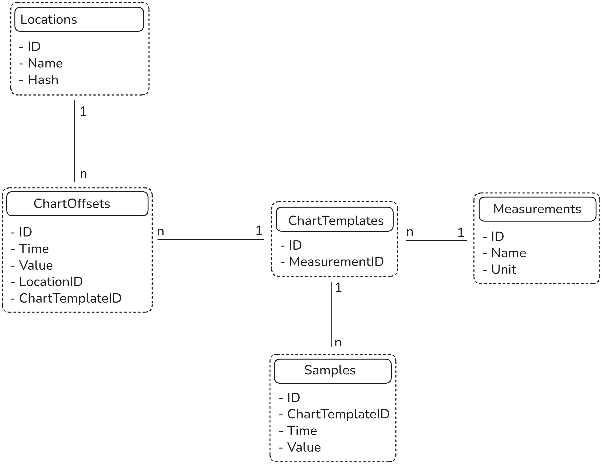
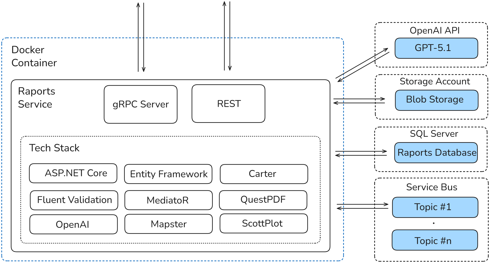
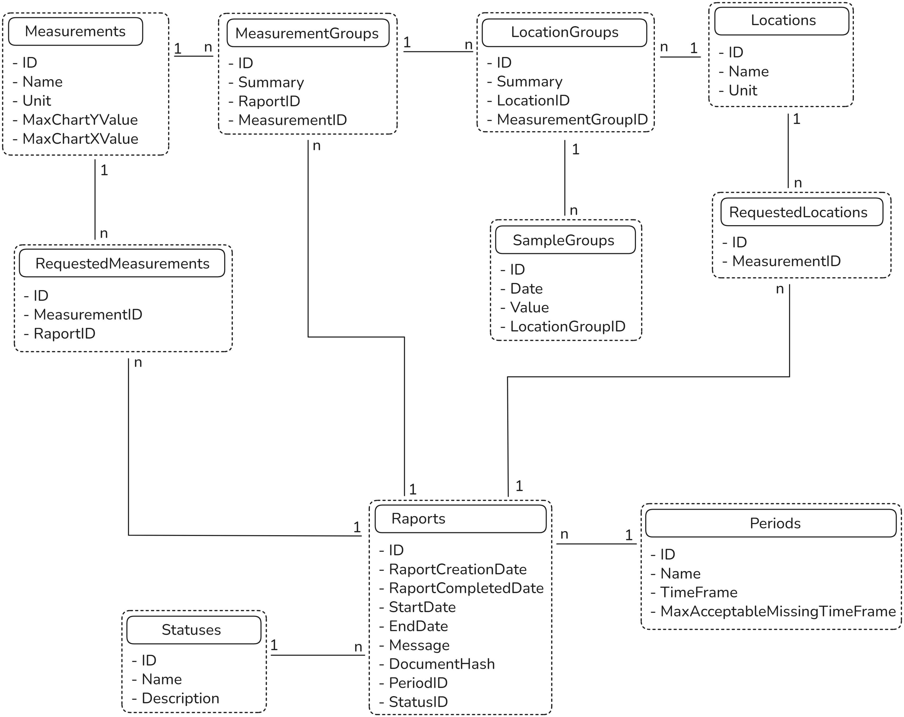
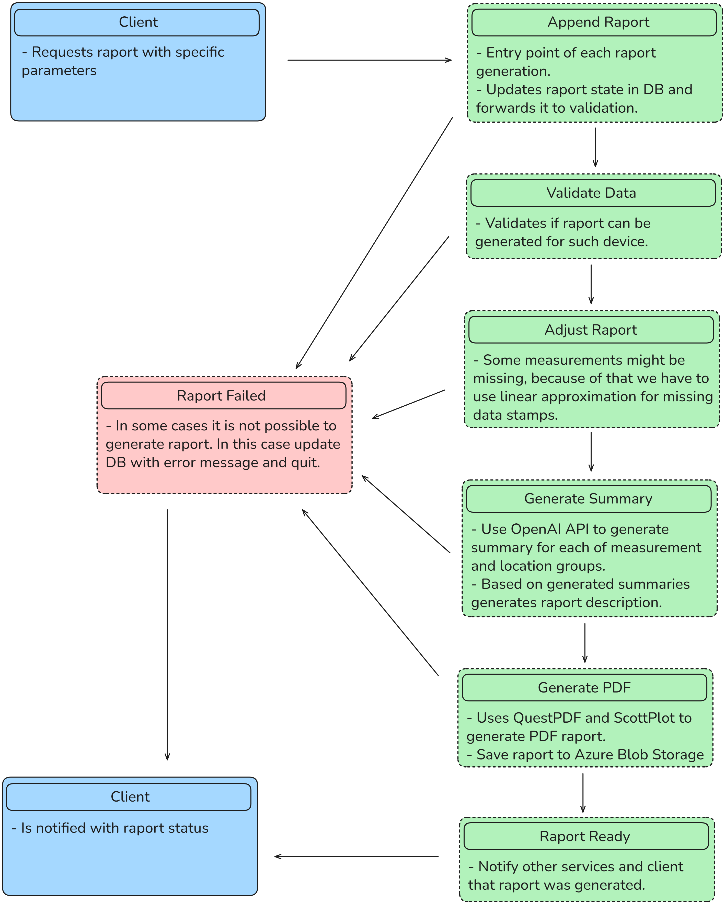
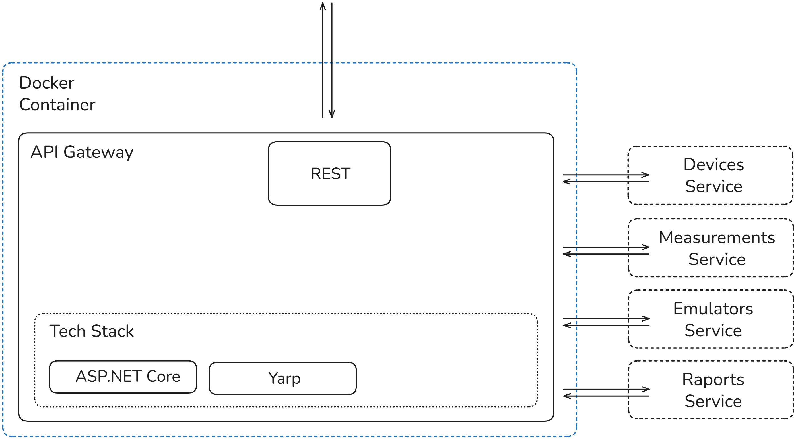

<div align="center">

# Homee System - Microservices

### Microservices architecture for IoT device management and monitoring

[](https://dotnet.microsoft.com/)
[](https://docs.microsoft.com/en-us/dotnet/csharp/)
[](https://dotnet.microsoft.com/apps/aspnet)
[](https://docs.microsoft.com/en-us/ef/core/)
[](https://www.microsoft.com/sql-server)
[](https://azure.microsoft.com/services/cosmos-db/)
[](https://azure.microsoft.com/services/service-bus/)
[](https://azure.microsoft.com/services/storage/blobs/)
[](https://grpc.io/)
[](https://dotnet.microsoft.com/apps/aspnet/signalr)
[](https://www.docker.com/)
[](https://masstransit.io/)
[](https://microsoft.github.io/reverse-proxy/)
[](https://github.com/jbogard/MediatR)
[](https://fluentvalidation.net/)
[](https://www.questpdf.com/)
[](https://openai.com/)

</div>

## 📖 Overview

Backend for **Homee System** - A .NET microservices architecture that provides device management, real-time environmental data collection, automated PDF raport generation, and AI-powered data analysis. The system enables device registration, measurement tracking for 15+ environmental parameters (temperature, humidity, air quality, etc.), and comprehensive raporting with LLM-based insights.

Built on `.NET 8` and `ASP.NET Core`, the backend is composed of four core microservices (`Devices`, `Measurements`, `Emulators`, `Raports`) orchestrated through an `API Gateway`. Services communicate via `gRPC` for inter-service calls and `Azure Service Bus` for event-driven workflows. The architecture is fully containerized with `Docker` and deployed to `Azure App Service`.

## 🏗️ Architecture Overview

### Microservices

The system is composed of independent microservices, each with dedicated databases and clearly defined responsibilities:

- **Devices Service** - Manages device lifecycle, configurations, and status using `Microsoft SQL Server`
- **Measurements Service** - Stores time-series sensor data in `Azure Cosmos DB` with flexible schema support
- **Raports Service** - Generates PDF raports using `QuestPDF` and stores them in `Azure Blob Storage`
- **Emulators Service** - Emulates devices.
- **API Gateway** - Routes external traffic using `YARP` reverse proxy with authentication and throttling

Each service exposes `RESTful APIs` for external communication and `gRPC endpoints` for efficient inter-service communication. Real-time updates are delivered via `SignalR WebSockets`.



### Communication Patterns

Services communicate using multiple protocols optimized for different use cases:

- **gRPC** - High-performance inter-service communication for data retrieval
- **AMQP** - Asynchronous messaging via `Azure Service Bus` for event-driven workflows
- **WebSockets** - Real-time data streaming to frontend clients via `SignalR`
- **REST APIs** - External client communication through the API Gateway


### Azure Deployment

Backend is deployed to Microsoft Azure using a combination of services optimized for microservices architecture:

- **Azure App Service** - Hosts the API Gateway and core microservices with built-in scaling and load balancing. Was used because of pricing. It is far the cheapest option for hosting microservice, even though it was not build for that.
- **Azure Cosmos DB** - Provides globally distributed, low-latency NoSQL database for measurement data.
- **Azure Service Bus** - Handles asynchronous messaging and event-driven communication between services.
- **Azure Blob Storage** - Stores generated PDF raports with high availability and durability
- **Azure SQL Database** - Manages relational data for Devices, Emulators and Raports services



## 📦 Devices Service

Manages detailed information about each device, including registration dates, descriptions, locations, statuses, and measurement schedules. Users can modify device information (e.g., changing location from 'Kitchen' to 'Living Room') and control device status to enable or disable measurement capturing capabilities. Measurement frequencies are configured using CRON expressions stored in a separate configuration table.

This service uses `Entity Framework Core` as the ORM for interacting with a `Microsoft SQL Server` database. It provides both a `gRPC server` for inter-service communication and `WebSockets` for real-time frontend updates.

### Architecture

The service exposes multiple communication channels: a gRPC server for inter-service communication, WebSockets for real-time data streaming to the frontend, and RESTful endpoints for device management operations.


### Database Diagram

The main goal of this service is to store device configurations that can be accessed by other services.


## 📊 Measurements Service

Stores time-series measurement data captured by devices using `Azure Cosmos DB`, a NoSQL database that provides low latency, high performance, and flexible schema support. The service handles dynamic data structures where measurement fields vary by device type—for example, a temperature-only sensor will store only temperature data, omitting other fields.

The service exposes both a `gRPC server` for inter-service data retrieval and `RESTful endpoints` for registering and querying measurements. For raport generation, it aggregates data from multiple sources and prepares datasets for the AiAssistant service to analyze.

### Architecture

The service architecture supports dual communication patterns: gRPC for efficient inter-service data exchange and REST APIs for device data ingestion and client queries.



### Database Entity

```json
{
    "id": "ffba2831-c186-4f57-b4a6-4103b151dfd2",
    "deviceNumber": "8070047f-f866-408f-bf2f-8822eb0f5e76",
    "measurementCaptureDate": "2025-11-29T16:02:30.178686Z",
    "locationHash": "138dfe8e-f8c6-462d-a768-0b7910ba61b0",
    "temperature": 22.4,
    "humidity": 41.25,
    "carbonDioxide": 591.52,
    "volatileOrganicCompounds": 87.19,
    "particulateMatter1": 4.04,
    "particulateMatter2v5": 8.01,
    "particulateMatter10": 16,
    "formaldehyde": 16.48,
    "carbonMonoxide": 591.52,
    "ozone": 13.09,
    "ammonia": 0.62,
    "airflow": 80,
    "airIonizationLevel": 563.48,
    "oxygen": 20.98,
    "radon": 38.51,
    "illuminance": 393.17,
    "soundLevel": 44.66
}
```

## 🔧 Emulators Service

Generates simulated measurement data for testing and development purposes. The service listens to device status changes from the Devices service via `Azure Service Bus` and dynamically adjusts measurement generation based on device configuration updates. This enables realistic testing scenarios without requiring physical sensors.

The service uses `Quartz.NET` as a CRON-based job scheduler to generate measurements at configured intervals. Scheduling configurations are stored in a `SQL Server` database, allowing flexible adjustment of measurement generation patterns based on location-specific templates.

### Architecture

When a device status change message is received, the service adjusts measurement generation parameters. Quartz.NET manages periodic jobs that generate measurements according to stored schedules and send them to the Measurements service.



### Database Diagram

The database stores predefined measurement templates that define realistic value ranges for different locations and environmental conditions. For example, a template might specify typical temperature ranges for a garage. Each template supports customization through parameters like X/Y offsets and device-specific precision settings, allowing fine-tuned control over generated measurement values.



## 📄 Raports Service

Generates comprehensive daily raports based on measurement data collected from devices. Raports are created as PDF files using `QuestPDF` and stored in `Azure Blob Storage`, ensuring they remain accessible even when the service is offline. The service uses an event-driven architecture with `Azure Service Bus` via `MassTransit` to orchestrate multi-stage raport generation workflows.

### Architecture

The service leverages the `OpenAI API` with GPT models to generate AI-powered summaries of measurement data. Completed raports are stored in `Azure Blob Storage` for long-term accessibility, while raport metadata and configuration are managed in a `SQL Server` database. The raport generation pipeline is built on `Azure Service Bus`, where each processing stage has dedicated topics and subscriptions for reliable message handling.



### Database Diagram

The database stores aggregated, sorted, and filtered measurement data for each specific raport. Users can customize raports by selecting which measurement types and locations to include, requiring a flexible schema design. Measurements are organized by location and measurement category to enable efficient querying and raport generation.



### Raport Generation Flow

Raport generation follows a multi-stage pipeline orchestrated through `Azure Service Bus` topics and subscriptions. Each green box in the diagram represents a consumer handling a specific stage of raport processing. If an error occurs at any stage, the raport message is routed to the 'Raport Failed' topic for error handling and monitoring.



## 🌐 API Gateway

Serves as the single entry point for all external requests, routing traffic to the appropriate microservices. Implemented using `YARP` (Yet Another Reverse Proxy), the gateway provides advanced features such as connection throttling, load balancing, and authentication. In this implementation, YARP primarily handles traffic routing and request consolidation, ensuring all client requests flow through a unified interface.

### Architecture

The gateway acts as a reverse proxy, intercepting incoming requests and forwarding them to the correct backend service based on routing rules.

