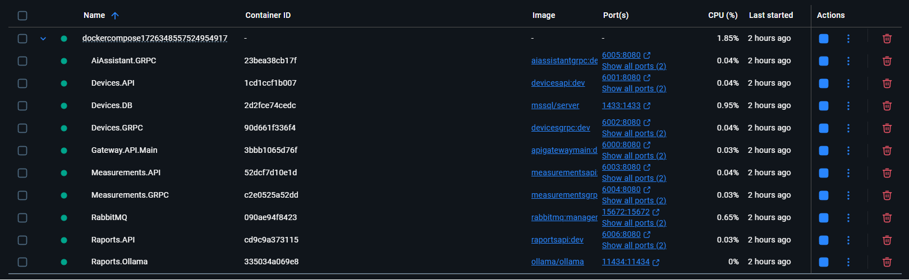

# `Homee system` - Backend


The `Homee System` backend is built with `.NET 8` and `ASP.NET Core`, designed as a distributed architecture composed of multiple `microservices` that operate independently yet integrate seamlessly to form a reliable and scalable platform. Its primary purpose is to serve as a central backend for managing devices and sensors within a single facility, enabling `device registration`, `real-time measurement data collection`, and `automated report generation`. 

System exposes both `RESTful` endpoints and `gRPC` connections to facilitate efficient client communication and service-to-service interactions. To ensure flexibility and scalability, the backend is fully `containerized` and optimized for deployment in orchestrated environments such as `Azure Container Apps` or local `Docker-compose`, while a Docker Compose setup allows developers to run the entire stack locally without requiring any external dependencies. 

This repository focuses on the `backend architecture` of the `Homee System`, emphasizing clean separation of concerns, high maintainability, and an `event-driven approach` to data processing.

## `System's components`

System is designed as a collection of independent services, each with a clearly defined responsibility:
- `Device Management` – Handles the full lifecycle of devices, including adding, updating, and removing them from the system.
- `Measurement Collection` – Records and stores data captured by devices for later processing and analysis.
- `Report Generation` – Creates comprehensive reports that summarize collected data and make it accessible for users.
- `Intelligent Assistant` – Analyzes measurement data, identifies key insights, and provides summaries that enhance the reports.

Additional supporting components include:
- `Message Queue` – Enables asynchronous communication between services, ensuring reliable data exchange.
- `Gateway Service` – Acts as a single entry point for all requests and routes them to the correct service within the system.

## `Architecture`

Backend architecture is illustrated in the following diagram:


At the top level, the system is composed of four core microservices (`Devices`, `Measurements`, `Reports`, and `AiAssistant`), supported by two key infrastructure components:

`API Gateway` – Serves as a single entry point for all external requests and routes them to the appropriate microservices. It is implemented using the `YARP` library, which offers advanced features such as `connection throttling` and `authentication`. In this implementation, `YARP` is primarily used for `traffic redirection` and consolidating all requests into one gateway.

`Message Queue` – Handles asynchronous messaging between services, implemented using `RabbitMQ` and the `MassTransit` library. It is one of the two communication methods between services and is primarily used to store and distribute messages related to report generation.

### `Microservices`

All microservices run inside separate `Docker containers` and are `orchestrated` together using `Docker Compose`, providing a fully containerized and self-contained backend environment.

- `Devices` - This microservice manages all operations related to `registering`, `updating`, and `removing devices` within the system. It uses `Entity Framework` as the `ORM` for interacting with a `MS SQL Server database`. This service also provides a `gRPC server` for sharing device information with other services. To maintain a clean and modular architecture, it leverages several libraries:
    - `FluentValidation` – Validating all incoming data.
    - `Carter` – Building minimal API endpoints.
    - `MediatR` – Implements the mediator pattern, enabling clean separation of concerns and streamlined request handling.
    - `Mapster` – Mapping between DTOs and internal domain models.

- `Measurements` - Microservice focuses on storing data captured by devices. Since the structure of measurement data can vary, a `NoSQL` database was chosen. It uses `Azure Cosmos DB`, which offers low latency, high performance, and generous free-tier storage. Like the Devices service, it also provides a `gRPC server` to share measurement data with clients. It features endpoints for registering and retrieving measurements. For report generation, this service aggregates data by calling the gRPC endpoints of Devices and other services, processes the data, and packages it for the AiAssistant service to produce descriptive insights.

- `Reports` - Generates data summaries based on the information stored in Measurements. Currently, it supports generating daily reports, which are exported as `PDF` files and stored in `Azure Blob Storage`. This design ensures that reports remain accessible even when the service is offline.

- `AiAssistant` - Uses an embedded `Ollama` container running `Meta’s LLaMa` model to analyze measurement data. It exposes a `gRPC server` that receives data packets, processes them, and generates descriptive summaries. These AI-generated summaries are then included in the final reports produced by the Reports service.

All microservices running in single `Docker-compose`:



---

# Devices

## Database schema

The `Devices` service manages detailed information about each device, including unique identifiers, registration dates, descriptions, and links to their locations, statuses, and measurement schedules. Devices are assigned statuses like registered, active, or removed to indicate their current state. Measurement frequencies are configured using CRON expressions stored in a separate configuration table, allowing flexible scheduling of device data collection. Together, these tables organize device data, operational states, and timing configurations to support effective device management.


## Showcase

This demo shows how to interact with `Devices` service via it's endpoints by using `Postman`.


---

# Measurements

## CosmosDB database

`Measurements` microservice uses `CosmosDB` database with it's `5 GB` free tier which is sufficient for usecases of this project.


## Examplary measurement data

The data sent to and received from the `Measurements` service can vary in structure, depending on the type of device and the measurements it performs. For example, a device might only capture temperature readings, in which case only the temperature field will be present while other fields will be omitted. By leveraging a `NoSQL database`, the system is able to store this dynamic data structure seamlessly, without requiring a predefined schema, allowing maximum flexibility in handling different types of measurement data.

```json
{
    "id": "97f2e838-f479-40be-92c7-e55896b01378",
    "DeviceNumber": "83f17437-0048-416e-a57a-a8a13a06a1df",
    "RegisterDate": "2025-06-14T00:38:34",
    "Temperature": {
        "Value": 22.30064309330003,
        "Unit": "°C"
    },
    "Humidity": {
        "Value": 42.49535920225,
        "Unit": "% RH"
    },
    "CO2": {
        "Value": 898.4858812123161,
        "Unit": "ppm"
    },
    "VOC": {
        "Value": 190.35422347880603,
        "Unit": "µg/m³"
    },
    "ParticulateMatter1": {
        "Value": 7.941211856272382,
        "Unit": "µg/m³"
    }
    # more ...
}
```

`Measurements` service can handle various types of measurements.

| Measurement Type                 |
| -------------------------------- |
| Temperature                      |
| Humidity                         |
| Carbon Dioxide (CO₂)             |
| Volatile Organic Compounds (VOC) |
| Particulate Matter 1 (PM1)       |
| Particulate Matter 2.5 (PM2.5)   |
| Particulate Matter 10 (PM10)     |
| Formaldehyde                     |
| Carbon Monoxide (CO)             |
| Ozone (O₃)                       |
| Ammonia                          |
| Airflow                          |
| Air Ionization Level             |
| Oxygen (O₂)                      |
| Radon                            |
| Illuminance                      |
| Sound Level                      |

## Showcase

This demo shows how to interact with `Measurements` service via it's endpoints by using `Postman`.


---

# Raports

## Flow

The following diagram illustrates the flow of generating a new report. First, a request to validate the measurements for the specified day is placed in the message queue (RabbitMQ). This step ensures that there is a complete and accurate dataset available for report generation. Once the validation is complete and successful, another message is added to the queue—this time to initiate the report generation process. The Reports service listens for such messages, consumes them, and begins generating the report.


When the Reports service starts generating a report, it requires several sets of data. First, it requests the validated dataset from the Measurements service via gRPC. Next, it retrieves device details from the Devices service, also via gRPC. The service then organizes the collected measurement data into packets, grouping values by categories such as temperature or humidity. These data packets are then sent to the AiAssistant service, where the LLM analyzes and summarizes the information. The analyzed insights are returned to the Reports service, which then finalizes and generates the report. Once completed, the report is stored in Azure Blob Storage, making it accessible for further use.


## Examplary raport

Here are some pages from generated raport.

<p float="left">
  
  
</p>

<p float="left">
  
  
</p>

<p float="left">
  
  
</p>


## Showcase

This demo shows how to enqueue raport generation by using `Postman`.


## Azure Blob Storage container


---

# AiAssistant

Here is code snippet from `AiAssistant` service that generates description based on input data packet.

```cs
using Microsoft.Extensions.Configuration;
using OllamaSharp;

namespace AIAssistant.Implementation.General;

public class OllamaRaportChat
{
    private readonly IConfiguration _configuration;
    private readonly OllamaApiClient _client;

    public OllamaRaportChat(IConfiguration configuration)
    {
        _configuration = configuration;

        string endpoint = _configuration.GetValue<string>("Ollama:Endpoint");
        string model = _configuration.GetValue<string>("Ollama:Model");

        _client = new OllamaApiClient(endpoint, model);
    }

    public async Task<string> HelloWorld()
    {
        string result = string.Empty;

        var res = _client.GenerateAsync("Hello, who are you?");
        await foreach (var item in res)
        {
            result += item.Response;
        }

        return result;
    }

    /// <summary>
    /// Returns description for given measurement input.
    /// </summary>
    /// <param name="input"></param>
    /// <returns></returns>
    public async Task<string> GenerateDescription(string input)
    {
        string result = string.Empty;

        string prompt = $"I will provide data for collected measurements for you. " +
            $"Your job is to analyze this data and create description of this measurements. " +
            $"I only want conclusions in one paragraph, plain text, witout obsolete symbols. Make sure answer is at least 300 words long. Reduce number of digits after decimal point to two. Dont put any notes to reponse." +
            $"Examplary answear:" +
            $"```" +
            $"Temperature measurements were concluded in two rooms ..." +
            $"```" +
            $"Data: {input}";

        var res = _client.GenerateAsync(prompt);
        await foreach (var item in res)
        {
            result += item.Response;
        }

        return result;
    }

}

```

---

# Endpoints

## Endpoints

``Devices`` microservice feature couple of endpoints. They are privided in table below.

| Method | URI                                    | Description                                                                               | Response                                                         |
| ------ | -------------------------------------- | ----------------------------------------------------------------------------------------- | ---------------------------------------------------------------- |
| GET    | `/devices/all`                         | Retrieve a list of all devices registered in the system.                                  | List of detailed device records including IDs and metadata.      |
| GET    | `/devices/{ID}`                        | Retrieve detailed information for a specific device by its unique ID.                     | Full device data including status and configuration details.     |
| GET    | `/devices/devicenumber/{DeviceNumber}` | Retrieve detailed information for a device by its unique device number.                   | Device data with current status and relevant attributes.         |
| POST   | `/devices/`                            | Register a new device or notify the system that a device is active (e.g., after restart). | Confirmation of registration along with the created device data. |
| PUT    | `/devices/{DeviceNumber}`              | Update information for an existing device identified by its device number.                | Confirmation of update with the latest device data.              |
| DELETE | `/devices/{ID}`                        | Remove a device from the system by its unique ID.                                         | Confirmation of deletion along with the removed device details.  |
| GET    | `/health`                              | Check the health status of the Devices microservice and its dependent services.           | Status report indicating service availability and health.        |

## Measurements

`Measurements` microservice feature couple of endpoints. They are privided in table below.

| Method | URI                                                     | Description                                                                                                             | Response                                                                               |
| ------ | ------------------------------------------------------- | ----------------------------------------------------------------------------------------------------------------------- | -------------------------------------------------------------------------------------- |
| GET    | `/measurements/all`                                     | Retrieve a list of all devices currently registered in the system.                                                      | List of full device details, including IDs and metadata.                               |
| GET    | `/measurements/{ID}`                                    | Retrieve detailed information for a specific device identified by its unique ID.                                        | Full device data including measurements and status.                                    |
| GET    | `/measurements/devices/{DeviceNumber}`                  | Retrieve detailed information for a device using its unique device number.                                              | Device data including recent measurements and status.                                  |
| GET    | `/measurements/devices/{DeviceNumber}/day/{DateTime}`   | Retrieve measurement data for a specific device for the specified day.                                                  | List of measurements recorded by the device on that day.                               |
| GET    | `/measurements/devices/{DeviceNumber}/week/{DateTime}`  | Retrieve measurement data for a specific device for the week containing the specified date.                             | Aggregated measurements for the specified week.                                        |
| GET    | `/measurements/devices/{DeviceNumber}/month/{DateTime}` | Retrieve measurement data for a specific device for the month containing the specified date.                            | Aggregated measurements for the specified month.                                       |
| POST   | `/measurements/`                                        | Register or update a device’s active status; used by devices to notify the server they are online or resumed operation. | Confirmation of device registration or update with device data.                        |
| DELETE | `/measurements/{ID}`                                    | Remove a device from the system by its unique ID.                                                                       | Confirmation of deletion along with the removed device data.                           |
| DELETE | `/measurements/devices/{DeviceNumber}`                  | Remove a device from the system using its unique device number.                                                         | Confirmation of deletion along with the removed device data.                           |
| GET    | `/health`                                               | Check the health status of this microservice, including its dependencies.                                               | Status report indicating health and availability of this service and related services. |

## Raports

`Raports` microservice feature one endpoint.

| Method | URI                                 | Description                                                                                    | Response                              |
| ------ | ----------------------------------- | ---------------------------------------------------------------------------------------------- | ------------------------------------- |
| POST   | `/raports/enqueuedaily/{DateTime}`  | Enqueue a request to validate measurements and generate a daily report for the specified date. | Confirmation of the enqueued request. |
